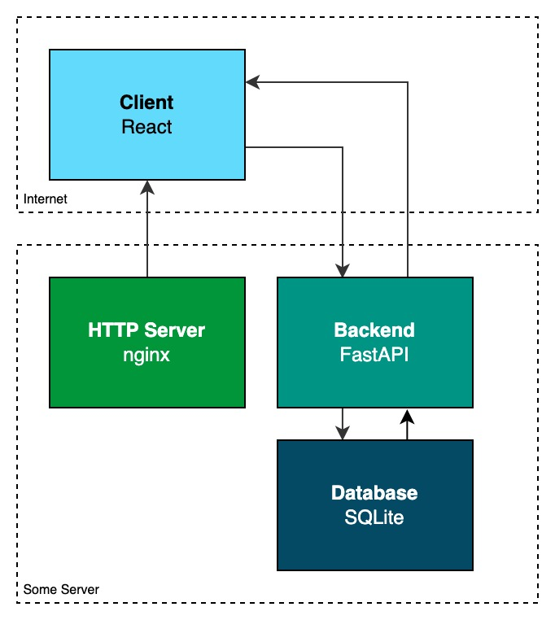

# TSBE WEB: Todo Web App
## About
This repository contains the UI (frontend) code for a todo web app. It's created with [React](https://www.reactjs.org/). The API (backend) can be found in the [todo_backend repository](https://gitlab.iet-gibb.ch/jerome.jamin/todo_backend).
## Scripts
- `npm run start`: Start app in dev mode locally
- `npm run test`: Run unit tests
- `npm run buiild`: Build app for production

## Project documentation
### Acceptance criteria
The todo web app has to provide following functionallity:
1. User can create account
2. User can login to account
3. User can create, read and delete categories
4. User can create, read, update and delete todos

### Mockups

### System architecture
This is a simplified sketch of the architecture:

The flow of the whole web app works as followed:
1. The client (browser) requests the React app from a [HTTP server](https://en.wikipedia.org/wiki/HTTP_server) (e.g. nginx). The HTTP Server then returns the required files (HTML, CSS, JavaScript) to the client.
2. The client executes the React app and displays the UI.
3. The React app makes requests for users, todos, categories and more to the FastAPI backend.
4. The FastAPI validates the requests from the React app and performs CRUD actions on the SQLite database.
5. After that the FastAPI returns the data to the React app and the React app displays it on the client.

### Backend
The backend is created with the [FastAPI](https://fastapi.tiangolo.com/) framework which allows this frontend application to create, read, update and delete data. For more information check out the [todo_backend](https://gitlab.iet-gibb.ch/jerome.jamin/todo_backend) repository or once the FastAPI is running locally go to the [API docs](http://localhost:8000/docs). The data is stored in a [SQLite](https://www.sqlite.org/) database.

## Conclusion
To develop this todo app wasn't very challenging for me as a frontend engineer. Although I enjoyed to create a new project from scratch and to take time and brain to think about how to structure the application code.

The only problem I encountered was with the `/users/me/todo/` API, I was only able to update or delete the newest todo item I created. After some knowledge exchange with my class mates I came to the conclusion that something wasn't right with the backend API.
